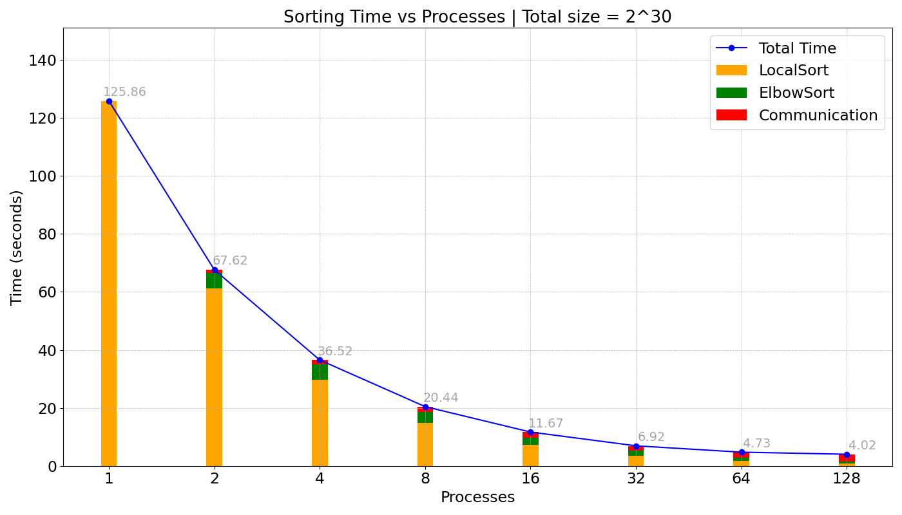

# Parallel and Distributed Systems - Exercise 2: MPI Bitonic Sort

This repository contains a hybrid parallel-sequential implementation of the Bitonic Sort algorithm designed for distributed execution using MPI (Message Passing Interface). The project demonstrates scalable sorting of large datasets across multiple processes and investigates the trade-offs between computation and communication in distributed environments.

## Table of Contents
1. [Overview](#overview)
2. [Setup](#setup)
3. [Compilation and Execution](#compilation-and-execution)
4. [Directory Structure](#directory-structure)
5. [Key Features](#key-features)
6. [Performance Insights](#performance-insights)
7. [Debugging and Cleanup](#debugging-and-cleanup)

## Overview

The **Bitonic Sort** algorithm is a comparison-based sorting method, ideal for parallel architectures due to its predictable and structured communication patterns. In this implementation:

- The dataset is divided among processes in a distributed memory system.
- Local sorting is performed using a sequential algorithm (e.g., `qsort`).
- Processes exchange and merge data using the Bitonic Sort approach, leveraging MPI for inter-process communication.
- A hybrid strategy minimizes communication overhead by combining sequential and parallel phases.

## Setup

Ensure the following dependencies are installed:

- **MPI Implementation**: Compatible with OpenMPI or MPICH.
- **C Compiler**: GCC or equivalent with MPI support.
- **Make**: For building the project.

## Compilation and Execution

### Compilation

Use the provided `Makefile` to compile the source code:

```bash
make
```

This generates an executable named `mpi_bitonic_sort` in the `bin/` directory.

### Running the Program

The program takes the following parameters:

- `q`: Log₂ of the number of elements per process.
- `p`: Log₂ of the total number of processes.

#### Run Command

```bash
make run q=<value> p=<value>
```

- Replace `<value>` with the desired values for `q` and `p`.
- Example:

```bash
make run q=16 p=4
```

This command will sort \(2^{16}\) elements using \(2^4 = 16\) processes.

## Directory Structure

- **`src`**: Source files (`main.c`, `bitonic_sort.c`, `utilities.c`).
- **`inc`**: Header files (`config.h`, `utilities.h`, `bitonic_sort.h`).
- **`Makefile`**: For building, running, and cleaning the project.

## Key Features

### 1. Hybrid Sorting Approach
- **Local Sorting**: Each process sorts its local data using `qsort`.
- **Distributed Sorting**: Processes exchange data in a hypercube communication topology, performing compare-and-swap operations to build and merge bitonic sequences.

### 2. Optimized Communication
- **Non-Blocking Communication**: Uses MPI’s non-blocking send/receive functions to overlap computation and communication.
- **Chunked Data Exchange**: Breaks data into smaller chunks to improve communication efficiency.

### 3. Elbow Sort
- **Linear Complexity**: Used for merging locally bitonic sequences, leveraging the sorted nature of the input.

### 4. Performance Metrics
- Built-in timers measure local sorting, communication, and overall execution time.
- Debug mode enables detailed logging of intermediate states.

## Performance Insights

### Speedup and Efficiency
- **Scalability**: Speedup increases with the number of processes but diminishes due to communication overhead as the process count grows.
- **Efficiency**: Best for larger datasets where computation amortizes communication costs.

### Communication Overhead
- Measured as a percentage of total execution time, highlighting the trade-off between computation and communication.
- Overhead increases with more processes but is mitigated by non-blocking communication and efficient topology mapping.



## Debugging and Verification

To enable debugging or sequential verification, uncomment the relevant lines in `config.h`:

```c
// #define DEBUG // Enables detailed output for debugging
// #define VERIFY_SEQUENTIAL // Enables comparison with sequential sorting
```

## Cleanup

To remove the compiled executable, use:

```bash
make clean
```

## Output

The program outputs the sorted data and timing statistics for each process. Use the debug mode to inspect intermediate states.

---
